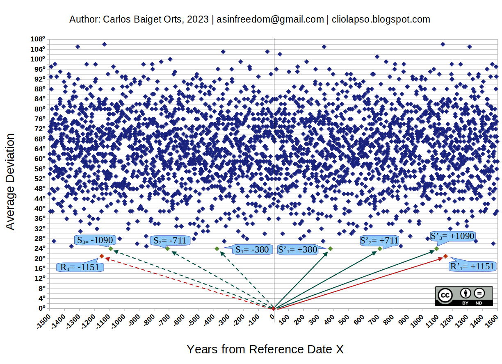

# 1151cycle

## Search for cycles in the ancient conception of the Solar System: Sun,Moon, Mercury to Saturn

A simple tool to search for cycles of the 'solar system of the ancients' (defined above) gives an atonishing answer:

Such cycles exist and the BEST OF THEM ALL begins EXACTLY 420403 days (1151.001 years) BEFORE OF AFTER any given date. This synchronism is maintained for centuries or even millenia.

Some 'newchronologers' find this preposterous, and think that 'is a completely ridiculous idea that such a cycle exists'.

*Others* have really checked its existence and decided to just remain silent about this, the reason being quite obvious.

Was this cycle employed to mess with chronology in the middle ages is something that SHOULD AND MUST be explored. 

A more than possible link with the Gregorian Reform of 1582 was the subject of a research I had to put to an end after much more urgent issue with historical chronology arised, (see https://github.com/carbaior/sescc)

After a brief code clean up, this SIMPLE tool will be uploaded to this repository for anyone to check its ridiculousness.

Meanwhile, an infographic of this phenomemon can be checked at: https://odysee.com/@CarlosBaiget:4/astronomical-proof-of-fomenko-and:0

Relaxed conditions on this code also explain the astronomical origin of the so called 'chronological shifts".
