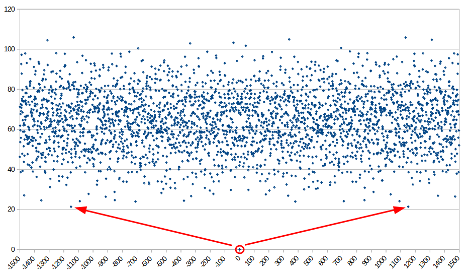

# horoscycles.py

# The discovery of the 1151-year planetary cycle this algorithm PROVES, inevitably implies the end of the New Chronology of Fomenko and Nosovsky.

# Both have been **hiding** this discovery for over a year, since October 2023, when they were personally informed.

# Their knowledge and understanding of this indisputable refutation of the New Chronology is a fact that I can prove, and I will undoubtedly do so if they choose to deny it.

## Search for cycles in the ancient conception of the Solar System: Sun,Moon, Mercury to Saturn

A <ins>simple</ins> tool to search for cycles of the 'solar system of the ancients' (defined above) gives an atonishing answer:

Such cycles exist and the BEST OF THEM ALL begins EXACTLY 420403 days (/365.25= **1151 years**) BEFORE OF AFTER any given date. This synchronism is maintained for centuries or even millennia.

This program was made to answer a simple question: 
**When in the past or future will the planets of the solar system of the ancients (Sun, Moon, Mercury to Saturn), be in positions that closely resemble those they held on a specific date?**

The answer of 1151 years is most surprising, as this time span is exactly what the "New Chronology of Fomenko and Nosovsky" (see  maintains separates Christ (born 1) and Andronikos I Komnenos (allegedly born 1152 = 1151 years _after_), whom they consider duplicates of the same historical figure (more information in the book by A.T. Fomenko and G.V. Nosovsky "Tsar of the Slavs").

Is this purely astronomical finding a confirmation or a refutation of their identification?

It is not an easy question to answer for most people, but apparently, it is very obvious to them themselves, as when this finding was communicated to them (in late 2023), they quickly dismissed it (as 'it was not of interest to their research')!??.

How is it possible that a **purely astronomical cycle** of the same magnitude as a fundamental premise of New Chronology is not of interest to them? It is certainly something very difficult to explain or even impossible to do so.
It is a very strange statement indeed, since Chapter 5 of Volume 3 of Book 2 - "Heavenly Calendar of the Ancients" is precisely called "ASTRAL CALENDAR. HOW OFTEN DOES THE SAME HOROSCOPE REPEAT?". And the reason for this chapter is to validate the results of their HOROS program.

It happens that bitter implications for NC may arise from this research.

But what are the implications? The main one is quite obvious: horoscycles.py compares the similarity of planetary positions over several centuries. This means that it finds day Y in the past such that the planets were most similar to a reference day X. Just as day Y+1 with X+1, Y+2 with X+2... and likewise for several thousand days. This is what is called a 'series': in the default configuration a timespan of 36525 days (one century), starting at the reference date, which is compared with the same series starting with a candidate date (the same calendar date of every year from -1500 to 1500). Therefore, ALL horoscopes can plausibly fit into a temporal shift of -1151 years. 

This aligns exactly not only with the horoscopes of Andronikos and Christ, but with those pointing to dates **after** them, in a **coherent** manner.

It seems like a worthy subject of study. On the other hand, the lack of explanations from the most interested parties could suggest that it has already been studied, and the conclusions are not favorable to their cause.

An infographic of this phenomemon can be checked at:  

Relaxed conditions on this code also explain the astronomical origin of the so called 'chronological shifts", which be included in future versions. As well as a the tool to generate the infographic.

## How to use this program?

horoscycles needs the numpy and skyfield libraries. You can install them with pip: `pip install numpy skyfield`

Then launch horoscycles.py:

`$ python horoscycles.py`

Output is self-explanatory. By default the reference date is 1/12/25 (middle of the interval and relevant date) and the series length is 1 century. Longer series will not give another answer. The search range is from -1500 to 1500 A.D.
You can change the parameters in the source code.

Finaly, the program creates an output file `cycles.csv`, that can be loaded to a spreadsheet to generate a scatter plot like the one above.

In the default configuration, the program will produce the `cycles.csv` which can be found in this repository.
You can load this file to a spreadsheet to draw a scatter plot that visually compares the series for all year. You'll probably have to reduce the size of the dots for them not to overlap.

The reference date has mean 0º of deviation with itself, so it will appear at the lowest point (circled). The best two synchronisms are just above 20º (arrows), which are exactly 420403 days in the past or in the future ( 420403/365.25=1151 years)

For the moment, this hypothesis is coded in the 'Gregorian Reform' option of 'Benjamin', my online horoscope dating program: . Without this flag, the "Leiden Aratea" is dated to 1433 in perfect concordante with NC date of the Carolingian Epoch. But when activated, the same horoscope gives the year of 816, **exactly** where the "Scaligerian chronology" says it **must** belong. 

To know why is this even possible, just ask Fomenko and Nosovsky about the most probable reason.

Doubts, suggestions, i've not explained myself well enough, etc.: email me at asinfreedom@gmail.com

